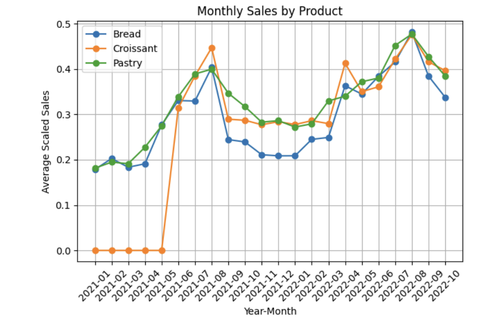
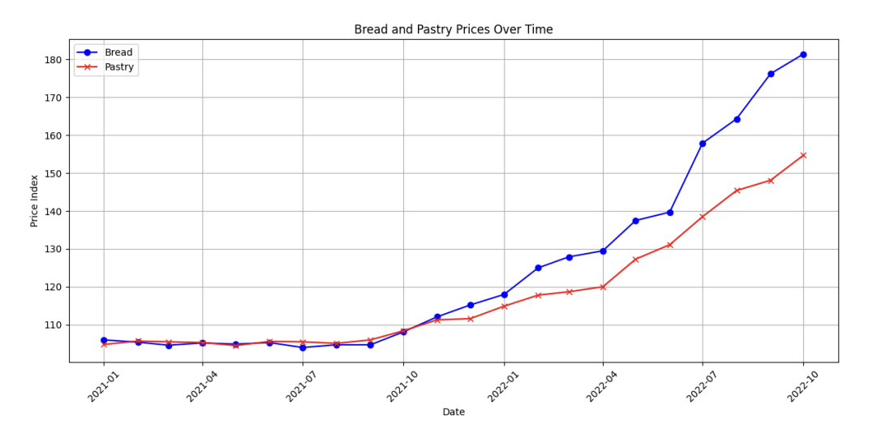

# 📊 Data-Driven Decision Making for Bakery Operations

## 📌 Project Overview
This project applies **data analytics techniques** to support strategic and operational decision-making in a bakery business.  
The objective is to analyze sales and operational data to identify patterns, optimize production, reduce waste, and improve overall profitability.

This project simulates the role of a **data analyst working with a small business** to transform raw data into actionable insights.

---

## 🎯 Business Problem
Bakeries often face challenges such as:

- Overproduction and food waste  
- Demand variability throughout the day/week  
- Inefficient inventory planning  
- Missed revenue opportunities  

**Key Question:**  
> How can data be used to improve operational efficiency and increase revenue in a bakery business?

---

## 📂 Dataset
The dataset contains transactional and operational bakery data, including:

- Date and time of sale
- Location
- Product name
- Sales amount

---

## 🛠️ Tools & Technologies
- Python
- Pandas
- NumPy
- Matplotlib / Seaborn
- Jupyter Notebook
- Excel

---

## 🔎 Project Workflow

1. **Data Collection**
   - Import and inspect dataset

2. **Data Cleaning**
   - Handle missing values
   - Standardize formats
   - Remove inconsistencies
   - Dealing with outliers

3. **Feature Engineering**
   - Time-based feature
   - Lagged values
   - Sales grouping

4. **Data Visualization**

5. **Insights & Recommendations**
   - Operational improvements
   - Production optimization
   - Marketing opportunities

---

## 📈 Key Insight

Both line charts show a clear **upward trend** over time. To examine the relationship between sales performance and economic conditions, we analyzed the correlation between **normalized bakery sales data** and the **Consumer Price Index (CPI)**.

The results indicate a **moderate negative correlation**:

- **Bread sales vs. Bread CPI:** −0.3208  
- **Pastry sales vs. CPI:** −0.3199  

These similar correlation values suggest a consistent inverse relationship between product sales and price-level changes. As CPI increases, sales tend to decrease moderately.

The **coefficients of determination (R²)** are:

- Bread category: **0.1029**
- Pastry category: **0.1023**

This indicates that approximately **10% of sales variability** can be explained by CPI changes, meaning CPI has a measurable but limited influence on demand.

### 💡 Business Implication
Incorporating CPI trends into demand forecasting models could support more accurate production planning and inventory management, enabling better data-driven decision-making for bakery operations.

---


## 📊 Example Visualizations
*Monthly sales by products*



*Bread and Pastry prices over time*


---

## 🚀 How to Run the Project

```bash
# Clone repository
git clone https://github.com/your-username/bakery-data-project.git

# Navigate into project
cd bakery-data-project

# Install dependencies
pip install -r requirements.txt

# Run notebook
jupyter notebook
